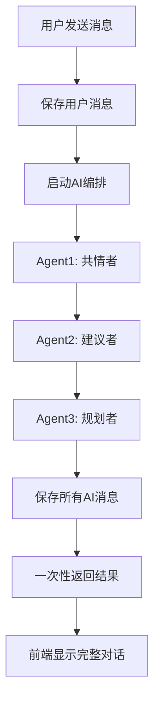

# 微信群聊模式使用指南

AI 朋友圈现在采用类似微信群聊的非流式交互模式

## 🎯 核心特点

### ✅ **微信群聊体验**

- 🕐 **等待完整回复**: AI 完全思考完毕后一次性显示所有回复
- 💬 **多人对话感**: 不同 Agent 的回复按顺序显示，就像群聊中多个朋友回复
- 🎨 **简洁 UI**: 清爽的对话界面，聚焦内容而非技术细节
- ⚡ **响应稳定**: 无流式输出的重复字符或连接问题

### ❌ **不再有的功能**

- ~~实时流式输出~~
- ~~停止按钮~~
- ~~SSE 连接~~
- ~~逐字显示~~

## 🏗️ 系统架构

### 请求流程



### 核心文件

#### **前端聊天页面**

- **文件**: `src/app/chat/[id]/page.tsx`
- **功能**: 简洁的微信风格聊天界面
- **特点**:
  - 无流式状态管理
  - 思考中动画
  - 一次性显示 AI 回复

#### **聊天 API 端点**

- **文件**: `src/app/api/conversations/[id]/chat/route.ts`
- **功能**: 处理用户消息并返回所有 AI 回复
- **流程**:
  1. 保存用户消息
  2. 调用非流式编排
  3. 返回完整结果

#### **非流式编排器**

- **文件**: `src/lib/orchestrator.ts`
- **方法**: `runChatOrchestration()`
- **功能**: 顺序执行多个 Agent，收集所有回复

#### **LLM 适配器**

- **文件**: `src/lib/adapters/openai-adapter.ts`
- **方法**: `chat()` (非流式)
- **功能**: 调用 LLM API 获取完整回复

## 💬 使用体验

### 用户操作

1. **输入消息**: 在输入框中输入想要咨询的问题
2. **发送**: 点击发送按钮
3. **等待**: 看到"AI 思考中..."提示和动画
4. **查看回复**: AI 完成思考后，多个 Agent 的回复会一次性显示

### AI 回复模式

```
用户: 我最近工作压力很大，不知道怎么办

💭 AI思考中... [动画效果]

AI(共情者): 我能感受到你的压力，工作压力确实会让人感到疲惫...

AI(建议者): 根据你的情况，我建议你可以尝试以下几个方法...

AI(规划者): 让我们制定一个具体的压力管理计划...
```

## 🔧 开发调试

### 日志监控

#### 前端日志

```javascript
📤 发送消息并等待AI回复...
✅ 收到AI回复，共 3 条消息
```

#### 后端日志

```bash
💬 收到聊天消息: { conversationId: "xxx", text: "..." }
✅ 用户消息已保存: msg_xxx
🎭 开始非流式编排: { conversationId: "xxx", content: "..." }
🎭 执行Agent: EMPATHY
⚙️ Agent配置 [EMPATHY]: { name: "共情者小暖", ... }
🚀 开始LLM调用 [EMPATHY] (非流式)
📍 URL: https://dashscope.aliyuncs.com/compatible-mode/v1/chat/completions
✅ LLM调用完成 [EMPATHY], 内容长度: 150
💾 AI消息已保存 [EMPATHY]: msg_yyy
🤖 AI编排完成，生成 3 条回复
```

### 性能特点

- **响应时间**: 通常 2-5 秒（取决于 Agent 数量和模型速度）
- **稳定性**: 无连接断开或重复问题
- **用户体验**: 类似真实群聊的等待-回复体验

## 🎨 UI 界面

### 消息样式

- **用户消息**: 蓝色气泡，右对齐
- **AI 消息**: 灰色气泡，左对齐，显示 Agent 名称
- **时间戳**: 每条消息下方显示发送时间
- **头像**: 用户显示"我"，AI 显示"AI"

### 加载状态

```typescript
{
  isLoading && (
    <div className="flex justify-start">
      <div className="rounded-lg p-3 bg-gray-100">
        <div className="flex items-center space-x-1">
          <div className="w-2 h-2 bg-gray-400 rounded-full animate-bounce"></div>
          <div
            className="w-2 h-2 bg-gray-400 rounded-full animate-bounce"
            style={{ animationDelay: "0.1s" }}
          ></div>
          <div
            className="w-2 h-2 bg-gray-400 rounded-full animate-bounce"
            style={{ animationDelay: "0.2s" }}
          ></div>
        </div>
      </div>
    </div>
  );
}
```

## 🔄 与流式模式的对比

| 特性           | 流式模式 | 微信群聊模式 |
| -------------- | -------- | ------------ |
| **显示方式**   | 逐字显示 | 一次性显示   |
| **用户体验**   | 实时感   | 群聊感       |
| **技术复杂度** | 高 (SSE) | 低 (HTTP)    |
| **稳定性**     | 易出问题 | 非常稳定     |
| **开发调试**   | 复杂     | 简单         |
| **资源占用**   | 长连接   | 短连接       |

## 🚀 优势总结

1. **📱 用户体验**: 更接近日常聊天软件的使用习惯
2. **🔧 开发效率**: 代码简洁，易于维护和调试
3. **🛡️ 系统稳定**: 无连接管理，无状态同步问题
4. **⚡ 响应可靠**: 要么成功要么失败，不会有中途断开
5. **🎯 聚焦内容**: 用户关注 AI 回复内容，而非技术实现

这种模式让 AI 朋友圈真正像一个朋友群聊，多个 AI 朋友依次给出建议和支持！ 🤝
